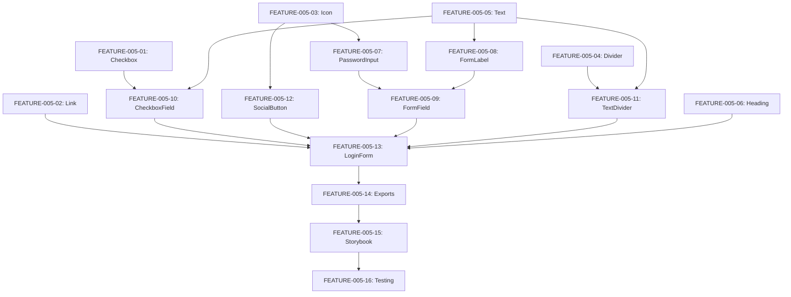

# FEATURE-005: Login Form Component Specification

## Component Hierarchy (Atomic Design)

```
LoginForm (Organism)
├── Heading (Atom) - "Login to your account"
├── Link (Atom) - "Sign up"
├── FormField (Molecule)
│   ├── FormLabel (Molecule)
│   │   └── Text (Atom)
│   └── Input (Atom) - Email
├── FormField (Molecule)
│   ├── FormLabel (Molecule)
│   │   └── Text (Atom)
│   └── Input with PasswordToggle (Atom)
│       └── Icon (Atom) - Eye/EyeOff
├── HStack
│   ├── CheckboxField (Molecule)
│   │   ├── Checkbox (Atom)
│   │   └── Text (Atom) - "Remember me"
│   └── Link (Atom) - "Forgot Password?"
├── Button (Atom) - "Login"
├── TextDivider (Molecule)
│   ├── Divider (Atom)
│   ├── Text (Atom) - "OR CONTINUE WITH"
│   └── Divider (Atom)
└── HStack
    ├── SocialButton (Molecule) - Google
    │   ├── Button (Atom)
    │   └── Icon (Atom)
    ├── SocialButton (Molecule) - Twitter
    │   ├── Button (Atom)
    │   └── Icon (Atom)
    └── SocialButton (Molecule) - GitHub
        ├── Button (Atom)
        └── Icon (Atom)
```

## Detailed Component Specifications

### Phase 1: Atoms

#### 1. Checkbox (FEATURE-005-01)
**File:** `packages/ui/atoms/Checkbox/Checkbox.tsx`

```typescript
interface CheckboxProps {
  checked: boolean
  onChange: (checked: boolean) => void
  disabled?: boolean
  size?: 'sm' | 'md' | 'lg'
  value?: string
}
```

**Implementation:**
- Re-export Gluestack UI Checkbox
- Custom styling for Cash App brand
- Support controlled component pattern
- Accessibility: aria-checked, role="checkbox"

---

#### 2. Link (FEATURE-005-02)
**File:** `packages/ui/atoms/Link/Link.tsx`

```typescript
interface LinkProps {
  onPress: () => void
  children: React.ReactNode
  variant?: 'primary' | 'secondary' | 'muted'
  disabled?: boolean
  underline?: boolean
}
```

**Implementation:**
- Use Gluestack Link or Pressable
- Variants: primary (blue), secondary (black), muted (gray)
- Support inline and standalone modes
- Accessibility: role="link", aria-label

---

#### 3. Icon (FEATURE-005-03)
**File:** `packages/ui/atoms/Icon/Icon.tsx`

```typescript
interface IconProps {
  name: 'eye' | 'eye-off' | 'google' | 'twitter' | 'github'
  size?: number
  color?: string
}
```

**Implementation:**
- Wrapper for react-native-svg
- Icon library: Use simple SVG paths or icon font
- Support theming via color prop
- Cross-platform compatible

**Required Icons:**
- eye: Password visibility on
- eye-off: Password visibility off
- google: Google logo
- twitter: Twitter logo
- github: GitHub logo

---

#### 4. Divider (FEATURE-005-04)
**File:** `packages/ui/atoms/Divider/Divider.tsx`

```typescript
interface DividerProps {
  orientation?: 'horizontal' | 'vertical'
  thickness?: number
  color?: string
}
```

**Implementation:**
- Re-export Gluestack Divider
- Support horizontal and vertical orientations
- Custom color and thickness
- Already available in Gluestack - verify export

---

#### 5. Text (FEATURE-005-05)
**File:** Already exists - verify variants

**Required Variants:**
- `heading-xl`: 24px Bold
- `text-sm-medium`: 14px Medium
- `text-sm-semibold`: 14px SemiBold
- `text-xs-normal`: 12px Regular
- `text-xs-medium`: 12px Medium

---

#### 6. Heading (FEATURE-005-06)
**File:** Already exists - verify variants

**Required Variants:**
- `xl`: 24px Bold

---

### Phase 2: Molecules

#### 7. Input with Password Toggle (FEATURE-005-07)
**File:** `packages/ui/atoms/Input/Input.tsx` (enhance existing)

```typescript
interface PasswordInputProps {
  value: string
  onChange: (value: string) => void
  placeholder?: string
  showPassword?: boolean
  onTogglePassword?: () => void
}
```

**Implementation:**
- Extend existing Input component
- Add InputSlot for eye icon
- Toggle between "password" and "text" type
- Use Icon atom for eye/eye-off

**Example:**
```tsx
<Input>
  <InputField type={showPassword ? 'text' : 'password'} />
  <InputSlot onPress={onTogglePassword}>
    <Icon name={showPassword ? 'eye-off' : 'eye'} />
  </InputSlot>
</Input>
```

---

#### 8. FormLabel (FEATURE-005-08)
**File:** `packages/ui/molecules/FormLabel/FormLabel.tsx`

```typescript
interface FormLabelProps {
  children: React.ReactNode
  required?: boolean
  htmlFor?: string
}
```

**Implementation:**
- Compose Text atom with spacing
- Add red asterisk if required
- Typography: text-sm-medium (14px Medium)

---

#### 9. FormField (FEATURE-005-09)
**File:** `packages/ui/molecules/FormField/FormField.tsx` (enhance existing)

**Enhancement:**
- Support password toggle integration
- Ensure compatibility with PasswordInput
- Already exists - verify it works with enhanced Input

---

#### 10. CheckboxField (FEATURE-005-10)
**File:** `packages/ui/molecules/CheckboxField/CheckboxField.tsx`

```typescript
interface CheckboxFieldProps {
  checked: boolean
  onChange: (checked: boolean) => void
  label: string
  disabled?: boolean
}
```

**Implementation:**
- Horizontal layout: Checkbox + Text label
- Use Checkbox atom
- Use Text atom for label
- Typography: text-xs-normal (12px Regular)

**Layout:**
```tsx
<HStack space="xs">
  <Checkbox checked={checked} onChange={onChange} />
  <Text>{label}</Text>
</HStack>
```

---

#### 11. TextDivider (FEATURE-005-11)
**File:** `packages/ui/molecules/TextDivider/TextDivider.tsx`

```typescript
interface TextDividerProps {
  text: string
}
```

**Implementation:**
- Three-part layout: Divider - Text - Divider
- Use Divider atom
- Use Text atom for centered text
- Typography: text-xs-medium (12px Medium)

**Layout:**
```tsx
<HStack space="sm" align="center">
  <Divider flex={1} />
  <Text>{text}</Text>
  <Divider flex={1} />
</HStack>
```

---

#### 12. SocialButton (FEATURE-005-12)
**File:** `packages/ui/molecules/SocialButton/SocialButton.tsx`

```typescript
interface SocialButtonProps {
  provider: 'google' | 'twitter' | 'github'
  onPress: () => void
  disabled?: boolean
}
```

**Implementation:**
- Compose Button atom with Icon atom
- Outline variant with provider icon
- Support three providers: Google, Twitter, GitHub
- Icon + optional text layout

**Layout:**
```tsx
<Button variant="outline" onPress={onPress}>
  <Icon name={provider} size={20} />
</Button>
```

---

### Phase 3: Organism

#### 13. LoginForm (FEATURE-005-13)
**File:** `packages/ui/organisms/LoginForm/LoginForm.tsx`

```typescript
interface LoginFormProps {
  // Form state (controlled component)
  email: string
  password: string
  rememberMe: boolean
  showPassword: boolean

  // Change handlers
  onEmailChange: (email: string) => void
  onPasswordChange: (password: string) => void
  onRememberMeChange: (checked: boolean) => void
  onTogglePassword: () => void

  // Action handlers
  onSubmit: () => void
  onForgotPassword: () => void
  onSignUp: () => void
  onSocialLogin: (provider: 'google' | 'twitter' | 'github') => void

  // State
  isLoading?: boolean
  error?: string
}
```

**Layout Structure:**
```tsx
<VStack space="md">
  {/* Header */}
  <HStack justify="space-between">
    <Heading size="xl">Login to your account</Heading>
    <Link onPress={onSignUp}>Sign up</Link>
  </HStack>

  {/* Email Field */}
  <FormField label="Email" error={emailError}>
    <Input>
      <InputField
        type="email"
        value={email}
        onChange={onEmailChange}
        placeholder="Enter your email"
      />
    </Input>
  </FormField>

  {/* Password Field */}
  <FormField label="Password" error={passwordError}>
    <Input>
      <InputField
        type={showPassword ? 'text' : 'password'}
        value={password}
        onChange={onPasswordChange}
        placeholder="Enter your password"
      />
      <InputSlot onPress={onTogglePassword}>
        <Icon name={showPassword ? 'eye-off' : 'eye'} />
      </InputSlot>
    </Input>
  </FormField>

  {/* Remember Me + Forgot Password */}
  <HStack justify="space-between">
    <CheckboxField
      checked={rememberMe}
      onChange={onRememberMeChange}
      label="Remember me"
    />
    <Link onPress={onForgotPassword}>Forgot Password?</Link>
  </HStack>

  {/* Login Button */}
  <Button
    action="primary"
    onPress={onSubmit}
    isLoading={isLoading}
  >
    <ButtonText>Login</ButtonText>
  </Button>

  {/* Divider */}
  <TextDivider text="OR CONTINUE WITH" />

  {/* Social Buttons */}
  <HStack space="sm" justify="center">
    <SocialButton
      provider="google"
      onPress={() => onSocialLogin('google')}
    />
    <SocialButton
      provider="twitter"
      onPress={() => onSocialLogin('twitter')}
    />
    <SocialButton
      provider="github"
      onPress={() => onSocialLogin('github')}
    />
  </HStack>
</VStack>
```

---

## Design Tokens

### Typography
- **Heading/xl**: 24px Bold - Main heading
- **Text-medium/sm**: 14px Medium - Form labels
- **Text-semibold/sm**: 14px SemiBold - Button text
- **Text-normal/xs**: 12px Regular - Checkbox label
- **Text-medium/xs**: 12px Medium - Divider text

### Spacing (4px base)
- **1**: 4px
- **1.5**: 6px
- **3**: 12px
- **5**: 20px
- **6**: 24px
- **8**: 32px
- **9**: 36px

### Border Radius
- **Inputs/Buttons**: 6px
- **Container**: 12px

### Colors (use Gluestack tokens)
- **Text**: `var(--text/*)`
- **Border**: `var(--border/*)`
- **Background**: `var(--background/*)`
- **Primary**: `var(--primary/*)`

---

## Storybook Stories Required

Each component needs:

1. **Default Story**: Basic usage
2. **Variants Story**: All visual variants
3. **Interactive Story**: User interactions
4. **States Story**: Loading, error, disabled
5. **Accessibility Story**: Keyboard nav, screen reader

### Example: Checkbox Stories
```typescript
export default {
  title: 'Atoms/Checkbox',
  component: Checkbox,
}

export const Default = () => <Checkbox checked={false} onChange={() => {}} />
export const Checked = () => <Checkbox checked={true} onChange={() => {}} />
export const Disabled = () => <Checkbox checked={false} disabled onChange={() => {}} />
export const Sizes = () => (
  <>
    <Checkbox size="sm" />
    <Checkbox size="md" />
    <Checkbox size="lg" />
  </>
)
```

---

## Cross-Platform Considerations

### React Native (Mobile)
- Use `Pressable` for touchable elements
- Use `react-native-svg` for icons
- Handle keyboard with `KeyboardAvoidingView`
- Support iOS/Android autofill
- Handle safe areas

### React Web
- Use semantic HTML where possible
- Support keyboard navigation (Tab, Enter)
- Support browser autofill
- Handle form submission (Enter key)
- Support copy/paste

### Shared
- All components use Gluestack UI primitives
- NativeWind for styling
- TypeScript for type safety
- Accessible by default

---

## Testing Checklist

### Per Component
- [ ] Renders on React Native (iOS)
- [ ] Renders on React Native (Android)
- [ ] Renders on React Web
- [ ] TypeScript types work
- [ ] Props validation works
- [ ] Storybook story works
- [ ] Accessibility features work
- [ ] Theme variants work

### Integration (LoginForm)
- [ ] All sub-components render
- [ ] Form submission works
- [ ] Validation works
- [ ] Loading states work
- [ ] Error states work
- [ ] Social login buttons work
- [ ] Password toggle works
- [ ] Responsive on all screen sizes

---

## Implementation Order

### Week 1: Atoms (Phase 1)
1. Checkbox (FEATURE-005-01)
2. Link (FEATURE-005-02)
3. Icon (FEATURE-005-03)
4. Divider (FEATURE-005-04)
5. Verify Text variants (FEATURE-005-05)
6. Verify Heading variants (FEATURE-005-06)

### Week 2: Molecules (Phase 2)
7. Password Input enhancement (FEATURE-005-07)
8. FormLabel (FEATURE-005-08)
9. FormField enhancement (FEATURE-005-09)
10. CheckboxField (FEATURE-005-10)
11. TextDivider (FEATURE-005-11)
12. SocialButton (FEATURE-005-12)

### Week 3: Organism (Phase 3)
13. LoginForm (FEATURE-005-13)
14. Package exports (FEATURE-005-14)
15. Storybook docs (FEATURE-005-15)
16. Cross-platform testing (FEATURE-005-16)

---

## Dependencies



---

## Success Criteria

1. All 16 tasks completed
2. All components have TypeScript types
3. All components have Storybook stories
4. All components work on mobile and web
5. LoginForm organism composes all components correctly
6. Visual design matches Figma specs
7. Accessibility requirements met
8. Cross-platform tests pass
9. Package exports updated
10. Documentation complete
